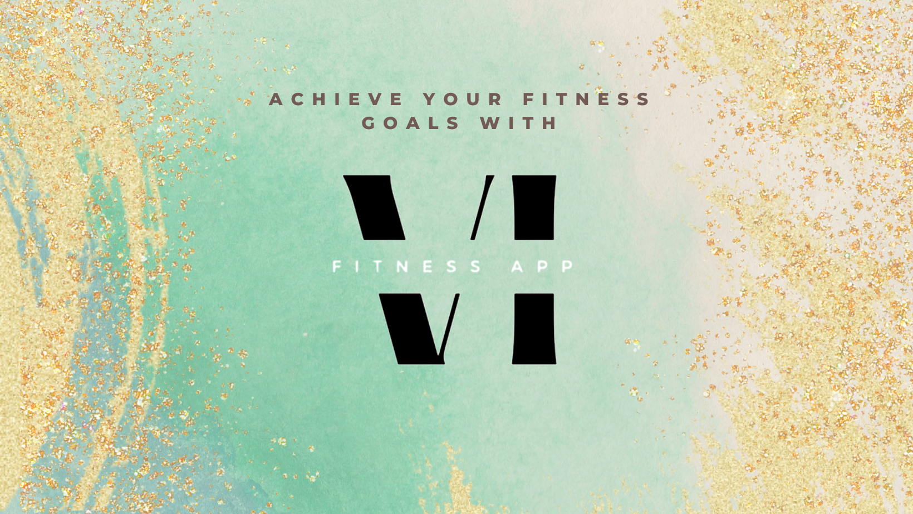
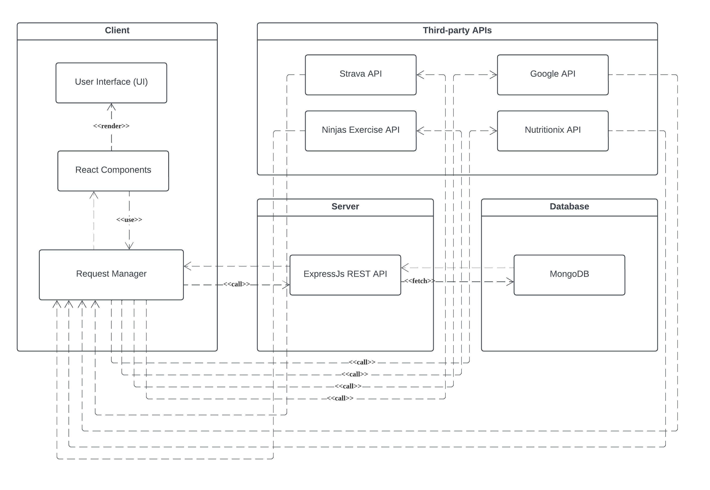

# SC2006VIFitness

## VI Fitness Web Application

<div>


</div>



### Team Member:

- [Oscar Qian](https://github.com/oscarqjh)
- [Lim Jing Jie](https://github.com/bron322)
- [Ng Yuen Herng](https://github.com/ngyh6726)
- [Tan Wei Yin](https://github.com/wytan12)
- [Jiang Jinyi](https://github.com/Jinyi087)
- [Prakritipong Phuvajakrt](https://github.com/Phuvj)

---

### Documentation

Documentation for this project includes:

- [Software Specification Requirement](./Documents/VIFitness%20Software%20Specification%20Requirement.pdf)
- [User Manual](https://sc-2006-vi-fitness.vercel.app/docs/guides/introduction/)
- [VI Fitness API Reference](https://sc-2006-vi-fitness.vercel.app/docs/developerapi/getting-started/)

### Environment Set up for Local Deployment (Recommended)

This project is developed with [React 18](https://react.dev/) and tested on [Visual Studio Code](https://code.visualstudio.com/).

**To run the application:**  
First, clone the repository into your local device, the directory should look something like this:

```
├── SC2006VIFITNESS
|   ├── Documents
|   ├── VIFitnessBackend
|   ├── VIFitnessFrontend
|   ├── VIFitnessDocumentation
```

Initialise your `.env` file. Check `.env.example` in both VIFitnessFrontend and VIFitnessBackend for the environment variables required.

You will require:

- [Nutritionix](https://www.nutritionix.com/business/api) API Client ID and API Key
- [Ninjas](https://api-ninjas.com/) API Key
- [Strava](https://developers.strava.com/docs/reference/) Client ID and Client Secret
- [Brevo](https://www.brevo.com/) API Key

Note: There are free tier for all the services listed above.

Next, set up the backend, in the terminal:

```
cd VIFitnessBackend
npm i
npm run dev
```

Next, set up the frontend, in a new terminal:

```
cd VIFitnessFrontend
npm i
npm run dev
```

### Live Deployment (Non-stable)

This project has been pushed to production at [https://sc-2006-vi-fitness-frontend.vercel.app/](https://sc-2006-vi-fitness-frontend.vercel.app/), however it is not recommended to experience VI Fitness via this method. Please use localhost for a better experience.

---

### Section 1: Introduction

In response to the rapid evolution of the digital era and Singapore's commitment to becoming a tech-driven Smart Nation, our team introduces VIFitness, a holistic web application designed to help users monitor their physical activity, diet, and overall health. The primary goal of VIFitness is to empower users with in-depth insights into their fitness and nutritional habits, enabling them to make informed decisions toward their health and fitness objectives. VIFitness focuses on three core functionalities, calorie tracking, workout planning and Strava Integration.

---

### Section 2: Features

#### 2.1 Workout Planner

VIFitness enables users to plan their workout sessions effectively. Users can create personalized workout plans, specifying exercise types and dates. A calendar view simplifies scheduling and visualizing workout routines. Leveraging the Nutritionix API integration, the application dynamically calculates and displays calories burned for each exercise based on user-specific parameters, such as age, weight, and gender.

#### 2.2 Macros Tracker

VIFitness integrates the Nutritionix API, offering users access to an extensive food database for precise calorie tracking and nutritional information. Users can log and monitor their daily meals, specifying food items and quantities. The application calculates and displays the total calorie intake, empowering users to make informed dietary choices.

#### 2.3 Strava Integration

VIFitness seamlessly integrates with the Strava API, allowing users to import their activities from Strava. The application calculates and displays the calories burned for each activity, providing users with a holistic view of their daily caloric intake and expenditure.

#### 2.4 VI Fitness RESTful API

VIFitness opened several RESTful API endpoints for third-party developers. This aims to create a healthy community of developers who are able to capitalise on the resources that VIFitness provides to develop third-party applications which can bring further utility to end users.

---

### Section 3: Software Architecture and Design Principles

#### 3.1 Software Architecture

  
Shown above is a simplified architecture diagram of our application. VI Fitness's backend is a RESTful API built with Express.js and MongoDB. While our frontend is built using React.js and React Router.

#### 3.2 High Cohesion and Loose Coupling

Our software architecture is intentionally structured to operate with distinct frontend and backend applications. This deliberate separation enables a high degree of loose coupling within our system. As a result, we have the flexibility to seamlessly transition between different frontend and backend technology stacks without incurring the significant costs associated with such changes.

#### 3.3 React Design Principles and Design Patterns

In this project, we fully embrace React's design principles and design patterns. This allowed us to build a highly robust application.

##### 3.3.1 Provider Pattern

In React, the provider pattern serves as a mechanism for distributing global data among various components within the React Component tree. This capability is harnessed through React's custom Hook feature, enabling the creation of customized contexts tailored for specific scenarios. A simplified example of this concept is illustrated below.

```
const rootElement = document.getElementById('root')
ReactDOM.render(
  <Provider store={store}>
    <App />
  </Provider>,
  rootElement
)
```

##### 3.3.2 Component Composition

At the heart of the React framework lies the fundamental practice of component composition. React encourages the dissection of intricate user interfaces into smaller, reusable components. This not only enhances code readability but also fosters the development of reusable elements, thereby boosting developer efficiency. This concept aligns with the implementation of the "Do not Repeat Yourself" (DRY) principle. Consequently, the adoption of a component-based architecture facilitates seamless code maintenance and management. In the event of an issue, pinpointing the problem becomes straightforward, as developers can easily identify the specific component involved.

---

_Submission: This repository is submitted to Nanyang Technological University Singapore as a project for module SC2006 AY2023_

<h3 align="center">Reference</h3>

[1]: [_Nutritionix v2.0 API Endpoints documentation_](https://developer.nutritionix.com/docs/v2)  
[2]: [_Strava API v3 API and SDK Reference Developer Documentation._](https://developers.strava.com/docs/reference/)  
[3]: [_Ninjas Exercise API documentation for developers_](https://api-ninjas.com/api/exercises)  
[4]: [_React Router v6.18.0 Documentation_](https://reactrouter.com/en/main)  
[5]: [_MongoDB documentation_](https://www.mongodb.com/docs)
