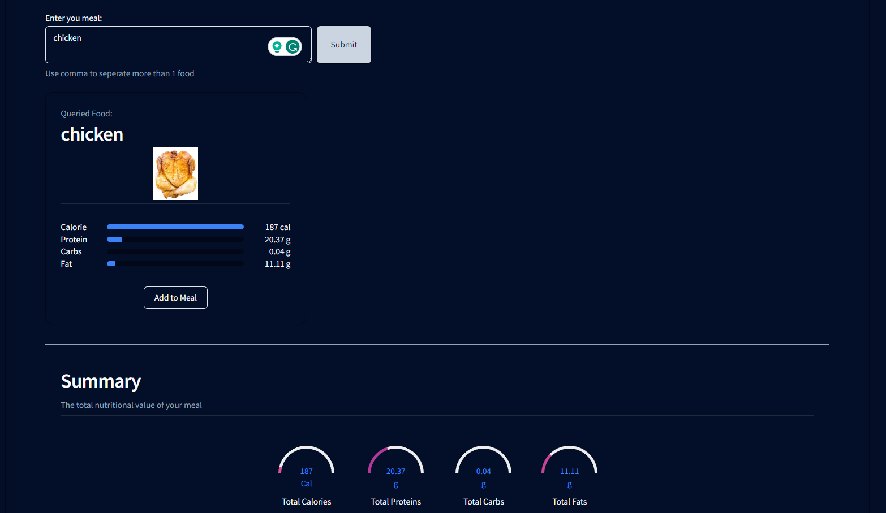

This section will cover the macros tracker functionality.

The macros tracker can be accessed via the sidebar.

## Setting Daily Limits

The first thing you should do when using this functionality is to calibrate your daily nutritional limits. This is the same as setting a goal for your daily intake.

## Query for Meal Nutrition

You can query for nutritional values of any food by typing the name of the food into the input field, then press query. Nutritionix API will then return the nutritional values of the queried food, which will be displayed in VI Fitness.

## Adding Food to Meal Tracker

You can queried food to meals by clicking on the `Add to Meal` button in each food card. This will then be stored in the database and will be displayed in the data table under `My Meals`. You may set the food as Breakfast, Lunch or Dinner.

## Statistical Overview

The nutritional values of all the food you have added to your meals will be compiled and shown in the statistical overview section. You may view them as Today, This Week or This Month.
