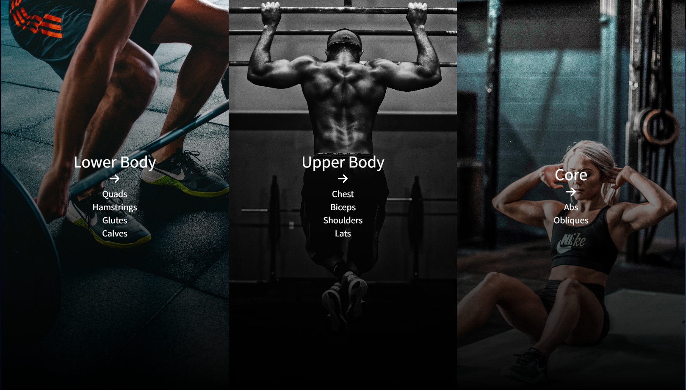
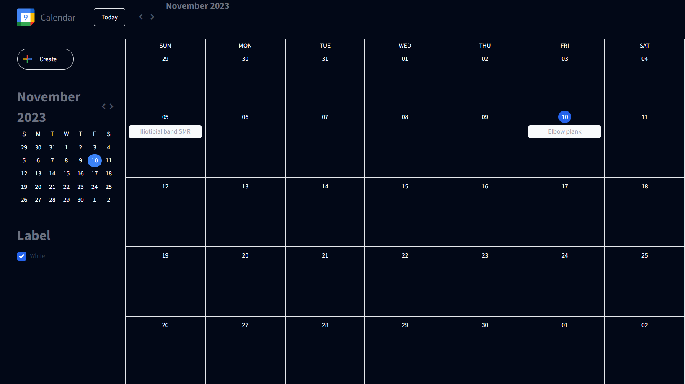

This section will cover the workout planner functionality.

## Exercise Selection

Workouts are categorised into 3 sections:

- Lower Body
- Upper Body
- Core

Upon selecting any of the options, Ninjas Exercise API will dynamically generate 6 workout suggetions for you to choose. Each exercise card will show the difficulty of the exercise, intructions and calorie burned.

## Add to Calendar

You may click on `Add to Calendar` button to add your chosen workout to your calendar to plan your workouts.

The exercise you added will be displayed in the calendar view which can be accessed via the sidebar. You can also click on any workouts and mark it as completed after your workout session.
